# 笨方法学python3
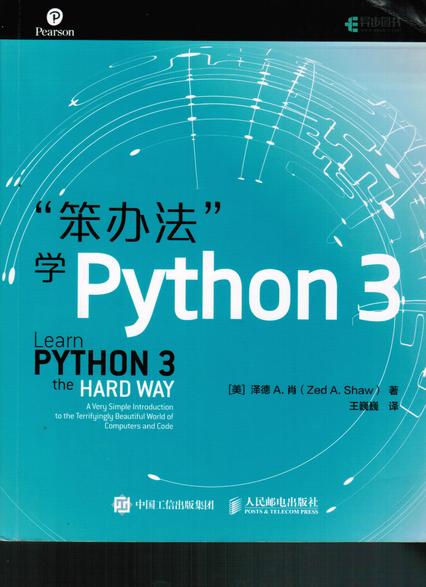
本仓库代码是在linux环境运行
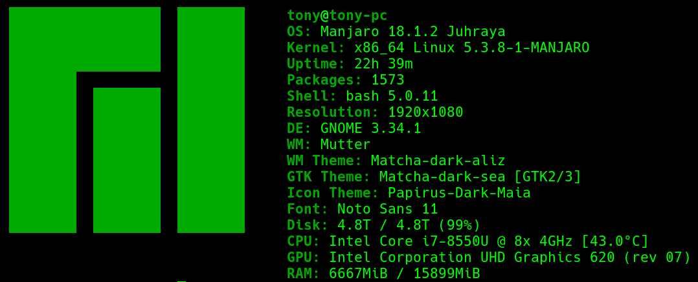

[笨方法学python3(中文字幕)](https://www.bilibili.com/video/BV1aE411V7xc)

[笨方法学Python3习题演示](https://www.bilibili.com/video/BV1ma411q765/)

# 目录
[TOC]
# Python官网
[Python Developer's Guide](https://www.python.org/dev/)
[PEPs (Python Enhancement Proposals)](https://www.python.org/dev/peps/)
[Python 3.x documentation](https://docs.python.org/3/)

### 习题5 —— 创建嵌入变量内容的字符串
使用 ```f“Your name is {your_name}”``` 的格式书写
 
##### 浮点数四舍五入
```python
a = round(1.7333)
print("1.7333 is", a)
```
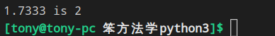

### 习题17 —— exists()
```python
from os.path import exists
...
exists()
```
将文件作文参数,如果存在就返回True,否则就是False
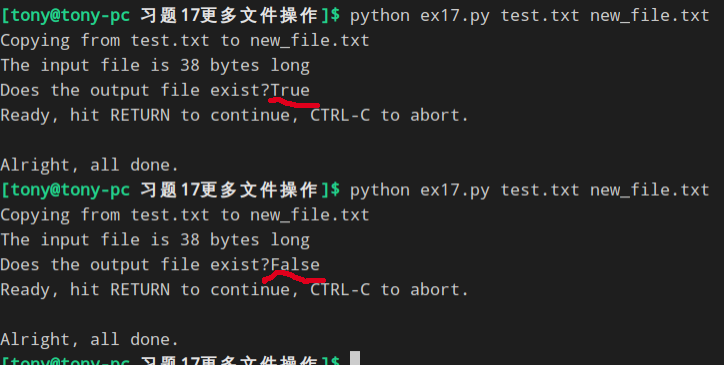

### 习题18命名、变量、代码和函数 —— *args
他告诉python吧所有的参数都接受进来，然后放到一个叫做 args 的列表里面
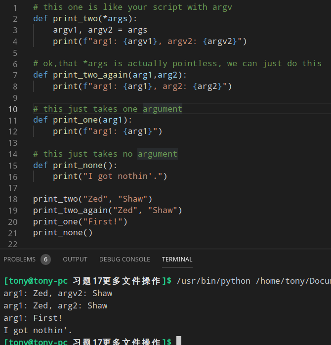


### 习题20函数和文件 —— 为什么seek(0)没有把 current_line 设为0
> 首先 seek() 函数处理的对象是<b>字节</b>不是<b>行</b>
> currnet_line 知识一个独立变量,和文件本身没有任何关系,<b>只能</b>手动为期增值

### 习题21函数可以返回某些东西 —— 输入整数与浮点数区别
##### 1.输入整数
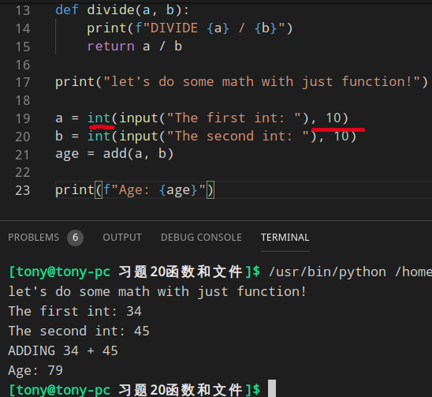
##### 2.输入浮点数
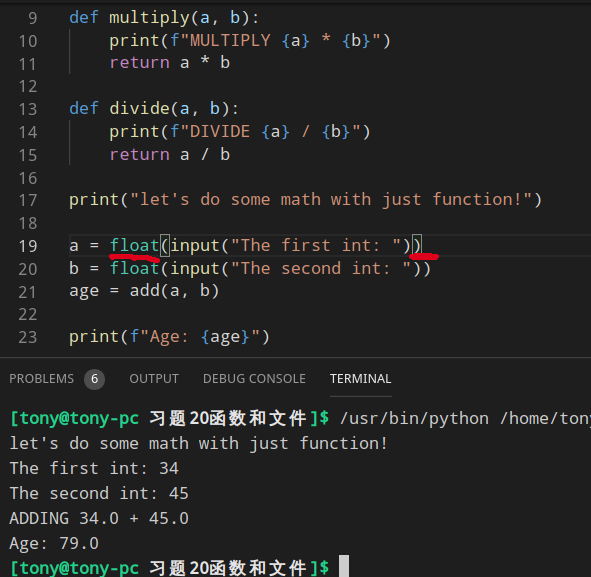


### 习题23字符串、字节串和字符编码 —— 编码、解码
```python
'''
.encode() 用来编码 
.decode() 用来解码
'''

def print_line(line, endcoding, errors):
    next_lang = line.strip()    #去掉每行结尾的 \n 
    raw_bytes = next_lang.encode(encoding, errors = errors)         # 对文字进行编码 encoding 是编码方式, errors 是处理错误的方式
    cooked_string = raw_bytes.decode(encoding, errors = errors)     # 对已经编码的字节串解码
```
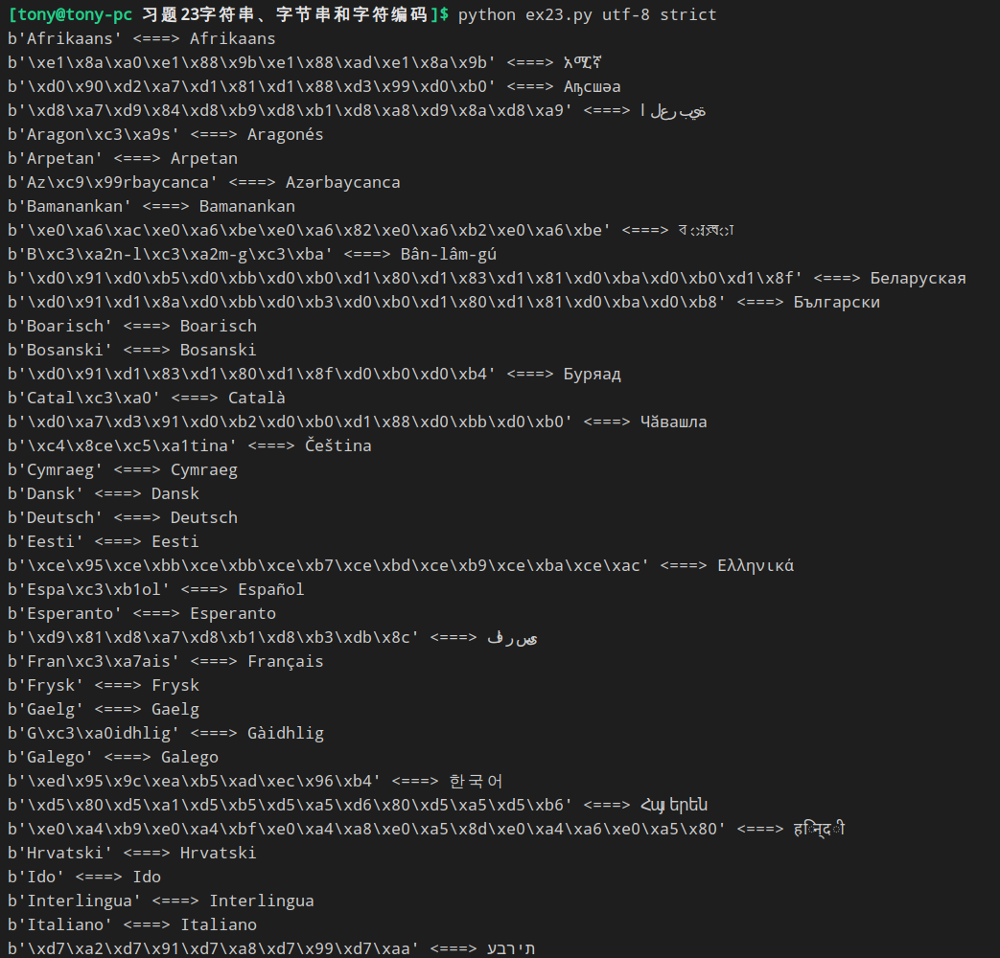

### 习题28布尔表达式练习 —— And 和 OR的返回值
为什么
```python
>>> "test" and "test"
'test'
>>> 1 and 1
1
```
返回的不是 True 和 False ?
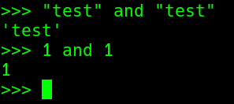
python返回的是被操作对象中的一个,不是True和False
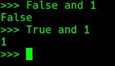
为什么返回这样的值 —— <b>短路逻辑</b>

##### 短路逻辑
这里面是<b>短路逻辑</b>:任何False开头的语句 + and 返回就是False,不会继续检查后面的;同理True开头 + or

### 习题30else和if —— 多个elif都是True处理
对于Python来说，<b>只会</b>运行第一个遇到True的模块

### 习题31做出决定 —— input()接收的是字符串
```python
door = input("> ")

if door == "1":
```

### 习题32循环和列表 —— 其实也可以不需要for循环,直接为 element 赋值
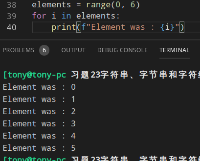
##### 数组与列表区别 
> list 不是数组
> 1）可修改，list数据结构内容可以被程序修改
> 2）可动态增减，长度不固定
> 3）list里面的数据项可以是不同类型数据，也可以是list
> 4）两个list可“链接”（通过+加法）构成一个更大的list
> 
> C语言数组
> 1）数组一般是固定长度
> 2）数组通常是在{ }之间，list数据类型名后无{ }
> 3）数组的各个数据项数据类型必须相同
> 4）两数组不可直接“链接”构成新的更大数组

### 习题33while循环 —— print多个在一行
```python
for num in numbers:
    print(num, end = " ")   # print输出是以 ' ' 作为分隔符
```
##### while与for区别
> for循环一般只能对集合进行循环
> while循环一般可以对任何事物循环

### 习题35分支和函数 —— exit(0)作用
在Linux系统里面,
> exit(1)表示发生错误
> exit(0)表示正常退出

这个与布尔逻辑正好相反,其实也可以规定一个```exit(1999)```来表示另一种与 exit(1) 和 exit(0) 不同的错误

### 习题37复习各种符号 —— 阅读代码
> 1.找一些python代码阅读
> 2.吧想要理解的代码打印到纸上
> 3.根据打印的代码做笔记
> - 1)每个函数及函数功能
> - 2)每个变量初始赋值的位置
> - 3)每个在程序的各个部分中多次出现的同名变量
> - 4)任何不包含 else 自己的if语句,他们是正确的吗?
> - 5)任何可能没有结束点的 while 循环
> - 6)代码中任何你看不懂的地方
>
> 4.理解代码之后要在计算机屏幕上在重读一遍


### 习题38列表的操作 —— 数据结构 --> 列表
数据结构就是组织数据的正确的方式,他所做的事情就是将数据结构化<br>
<b>列表</b> 就是其中的一种数据结构

##### Python 列表(list) join()方法
Python join() 方法用于将序列中的元素以指定的字符连接生成一个新的字符串。
```python
print(' '.join(stuff))          # 使用' '连接stuff的元素
print('#'.join(stuff[3:5]))     # 使用 # 连接stuff第4个与第5个元素

# join()方法语法：
str.join(sequence)  # sequence -- 要连接的元素序列。
# 返回通过指定字符连接序列中元素后生成的新字符串。
str = "-"
seq = ("a", "b", "c")  # 字符串序列
print str.join( seq )
```
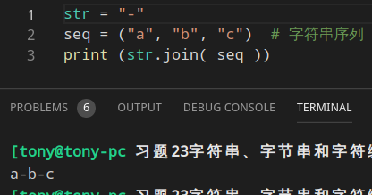

### 习题39字典，可爱的字典 —— 数据结构 --> 字典
这里讲的是关于<b>字典</b>这种数据结构<br>
<b>字典</b>:将 <b>键</b>与 <b>存储值</b> _映射_(或 _关联_)的一种方法,就像你查英汉字典一样,汉语的 <b>"杨秉学"</b> 对应的英文就是 <b>"handsome"</b> 一样

##### Python 字典(Dictionary) items()方法
Python 字典(Dictionary) items() 函数以列表返回可遍历的(键, 值) 元组数组。
> 语法: items()方法语法：
> dict.items()
> 参数: NA。
> 返回值: 返回可遍历的(键, 值) 元组数组。

```python
dict = {'Ybx': 'The most brillant man', 'YBX': 'The most handsome man', 'ybx': 'genius'}

# 遍历字典列表
for key,values in  dict.items():    #注意这个 for 循环的使用
    print (key,"<------>",values)
```
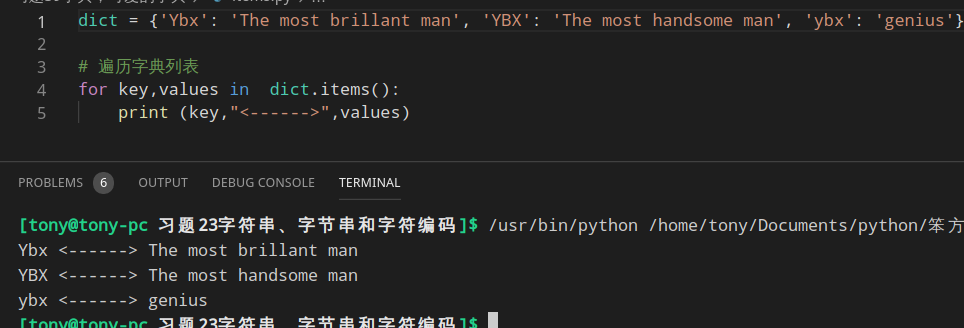

##### [字典与列表比较](习题39字典，可爱的字典/README.md)

### 习题43 基本的面向对象分析和设计
##### 设计思路
> 首先应该有这题的层次结构
> 然后写基本骨架代码,里面包含类和函数
> 在写一段测试运行这段代码,保证这些雷和函数是可以运行的
> 增加一点,测试一下,知道整个项目完成

### 习题44 继承与组合
<b>继承</b>与<b>组合</b>说到底就是为了解决 <i>代码复用</i> 的问题<br>
继承:创建子类的时候可以隐含父类的功能<br>
组合:利用模块与其他类中的<b>函数调用</b>来达到目的的<br>
> 建议
> - 避免多继承,除非思路清晰
> - 如果一些代码会在不同位置应用,那就用<b>组合</b>做成模块
