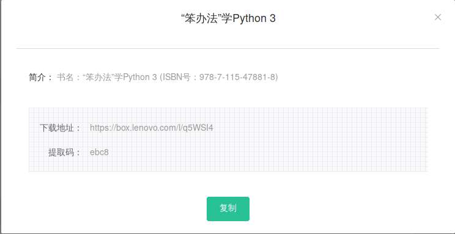

# 习题0 准备工作
[MacOS安装python3](https://www.bilibili.com/video/av79335252?p=1)<br>
[Windows安装python3](https://www.bilibili.com/video/av79335252?p=2)

### linux安装
```
pacman -S pyhton3
```
### 本书配套资源


### 建议使用Linux学习Python
Linux可以安装好几个版本,python2与python3,在windows使用Python就显得Windows很奇怪<br>
本书使用的是python3.6,这个仓库使用的是3.7,实际上代码是完全兼容的