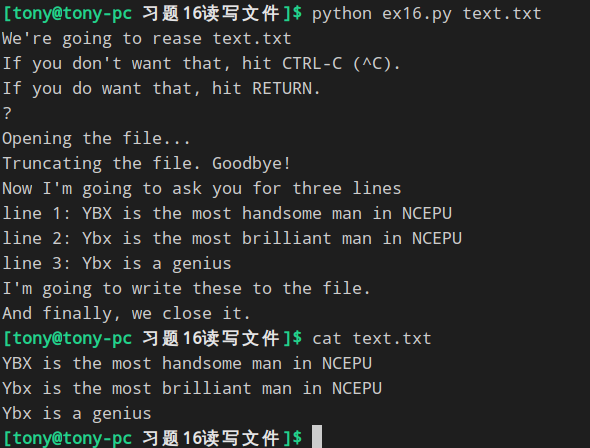

# 读写文件

- close()       
- read()    
- readline()    #只读取文件一行
- truncate()    #清空文件
- ```write('stuff')```  #将stuff写入文件
- seek(0)       #将读写位置移动到文件开头



### 如果你用 'w' 模式打开文件，那么你是不是还要 target.truncate() 呢？
是的，如果不truncate（）一下，文件会以a模式打开
> a 打开一个文件用于追加。如果该文件已存在，文件指针将会放在文件的结尾。也就是说，新的内容将会被写入到已有内容之后。如果该文件不存在，创建新文件进行写入。