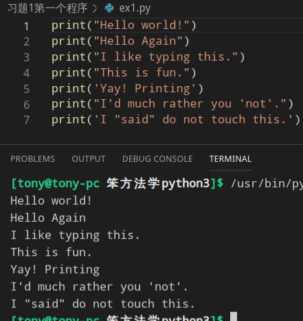
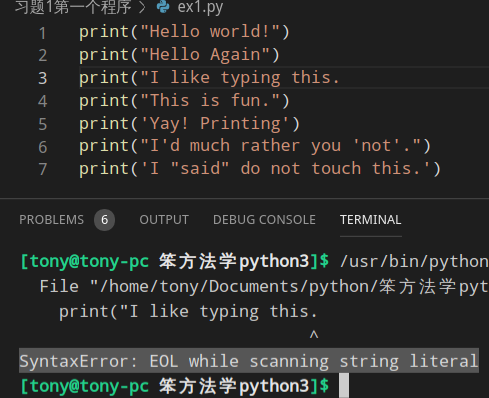

# 习题1第一个程序
### 视频教程
[linux版本](https://www.bilibili.com/video/av79335252?p=3) 
[MacOS版本](https://www.bilibili.com/video/av79335252?p=4) 
[Windows版本](https://www.bilibili.com/video/av79335252?p=5) 

### 运行结果

