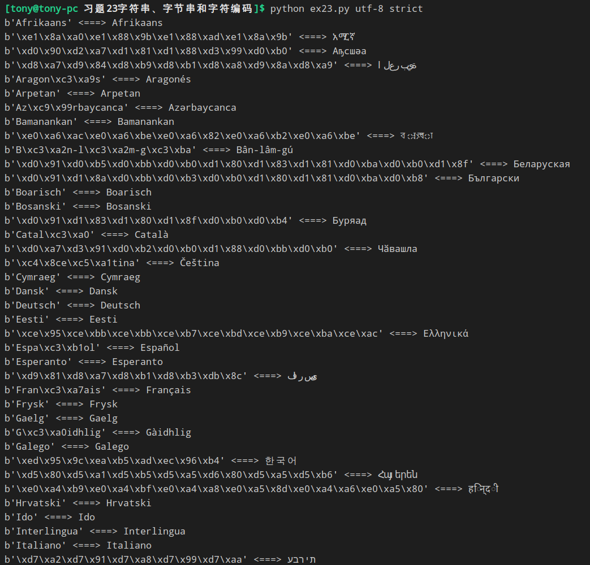
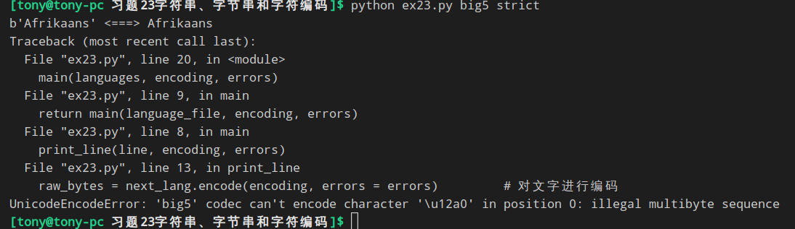

### 编码与解码
这个习题只要记住两个函数 ```.encode() 用来编码 .decode() 用来解码``` 就可以了
```python
'''
.encode() 用来编码 
.decode() 用来解码
'''

def print_line(line, endcoding, errors):
    next_lang = line.strip()    #去掉每行结尾的 \n 
    raw_bytes = next_lang.encode(encoding, errors = errors)         # 对文字进行编码 encoding 是编码方式, errors 是处理错误的方式
    cooked_string = raw_bytes.decode(encoding, errors = errors)     # 对已经编码的字节串解码
```


### 换其他编码
