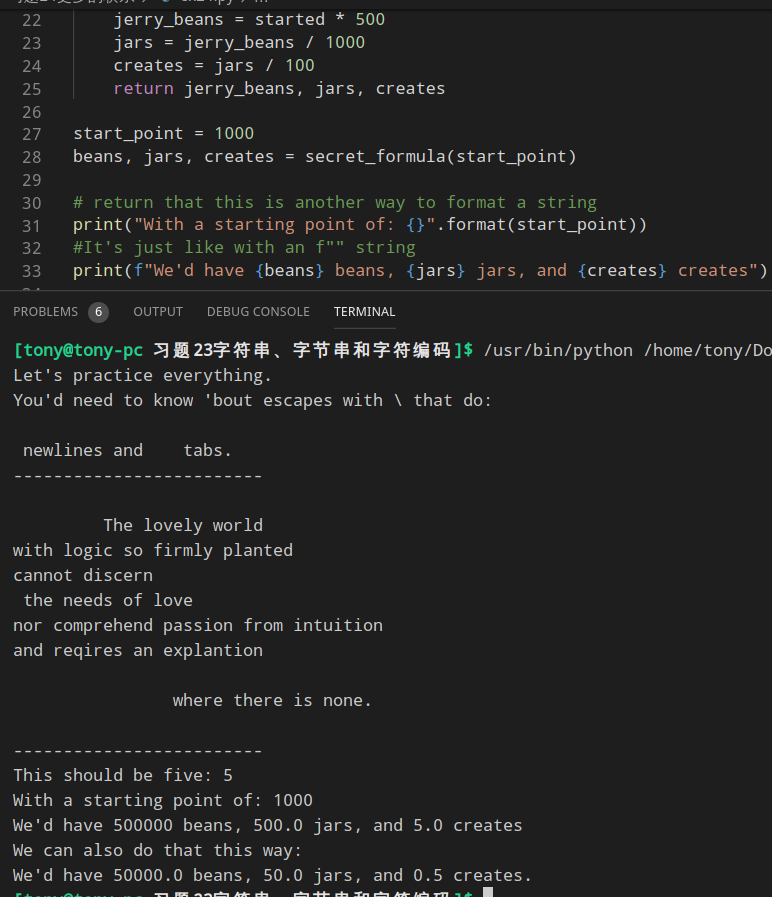

```python
start_point = 1000
beans, jars, creates = secret_formula(start_point)  # 使用三个变量分别对应

# return that this is another way to format a string
print("With a starting point of: {}".format(start_point))
#It's just like with an f"" string
print(f"We'd have {beans} beans, {jars} jars, and {creates} creates")

start_point = start_point / 10

print("We can also do that this way:")
formula = secret_formula(start_point)               # 使用 *formula 表示全部 —— 见习题18
# this is an easy way to apply a list to a format string
print("We'd have {} beans, {} jars, and {} creates.".format(*formula))
```
