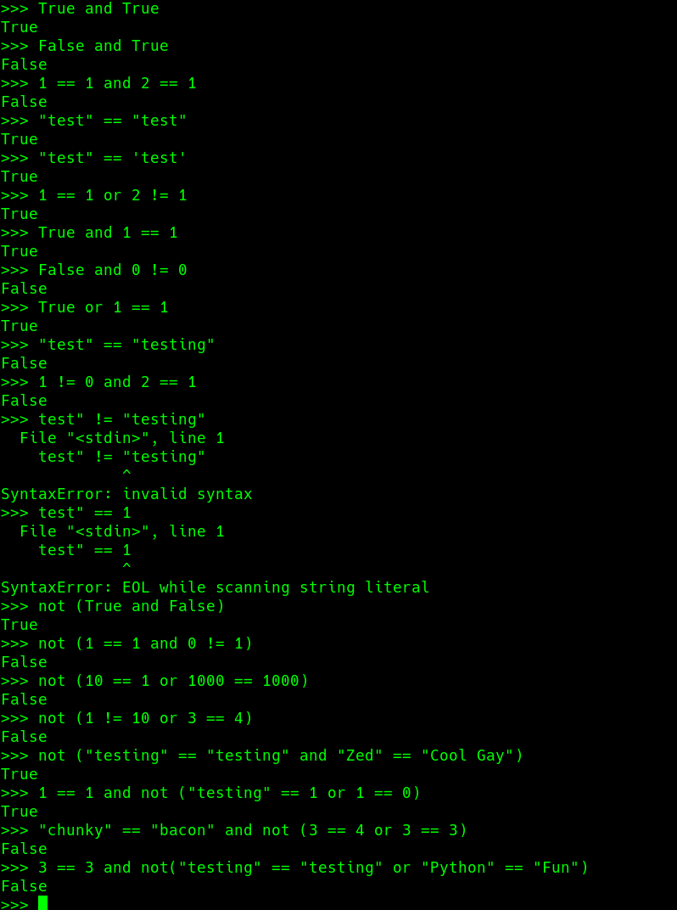
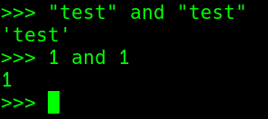
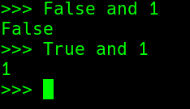

### 疑问
为什么
```python
>>> "test" and "test"
'test'
>>> 1 and 1
1
```
返回的不是 True 和 False ?

python返回的是被操作对象中的一个,不是True和False

为什么返回这样的值 —— <b>短路逻辑</b>

### 短路逻辑
这里面是<b>短路逻辑</b>:任何False开头的语句 + and 返回就是False,不会继续检查后面的;同理True开头 + or
