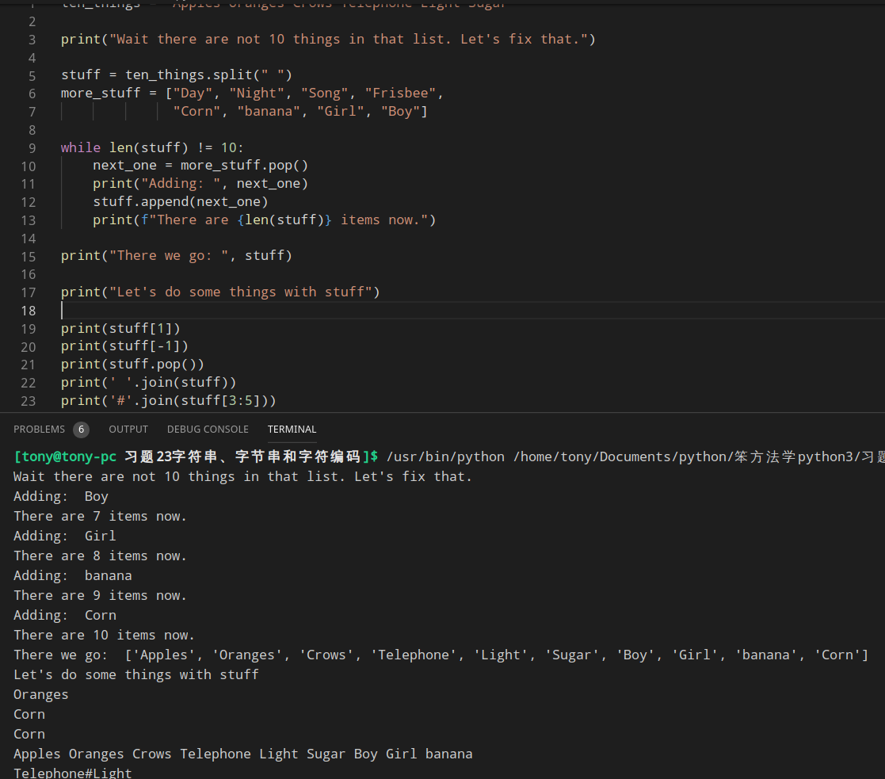
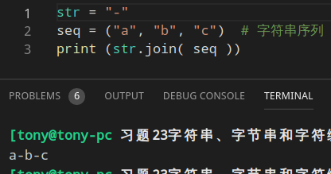

### 创建基于[《GO FIsh》](https://cardgames.io/gofish/)的游戏

### 数据结构
数据结构就是组织数据的正确的方式,他所做的事情就是将数据结构化

### 什么时候使用列表
> 维持次序

### join()方法
Python join() 方法用于将序列中的元素以指定的字符连接生成一个新的字符串。
```python
print(' '.join(stuff))          # 使用' '连接stuff的元素
print('#'.join(stuff[3:5]))     # 使用 # 连接stuff第4个与第5个元素

# join()方法语法：
str.join(sequence)  # sequence -- 要连接的元素序列。
# 返回通过指定字符连接序列中元素后生成的新字符串。
str = "-"
seq = ("a", "b", "c")  # 字符串序列
print str.join( seq )
```
