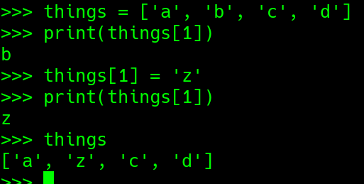
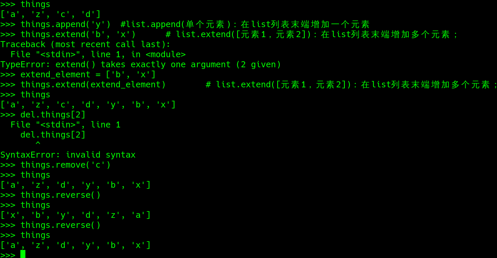
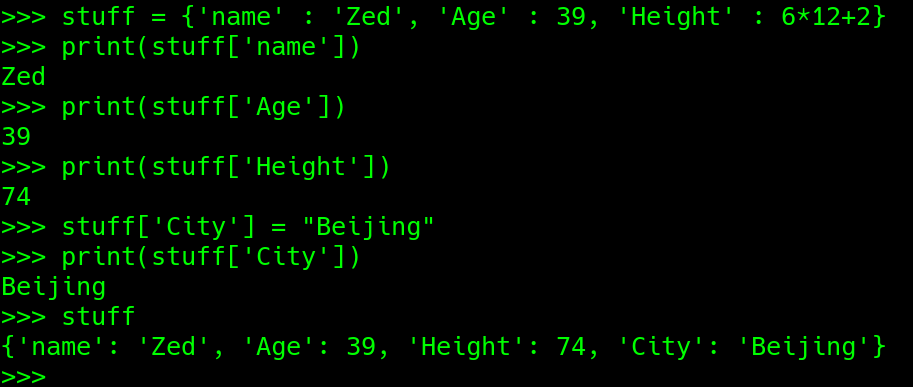
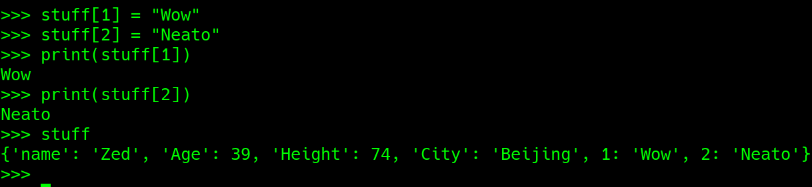
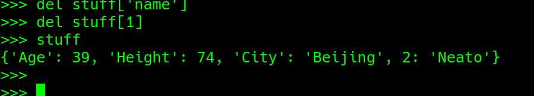
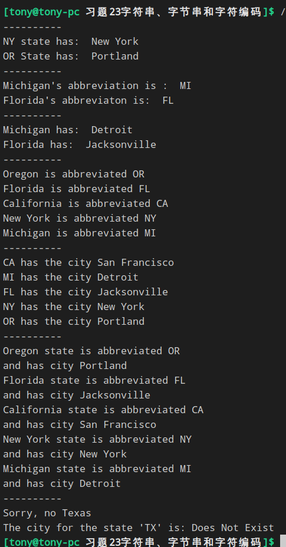
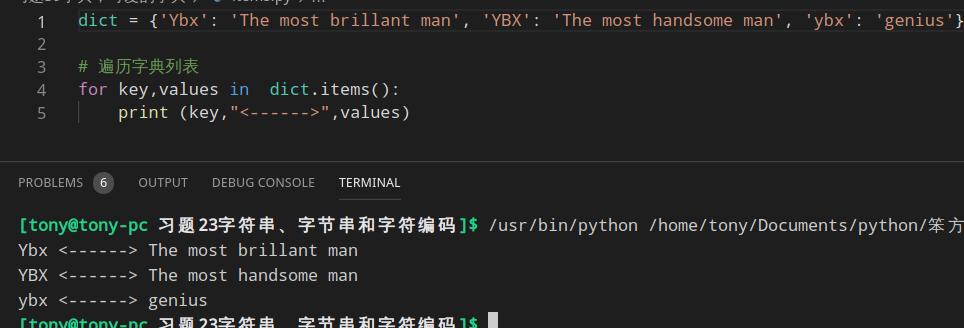

### 比较列表与字典
##### 列表
通过数值索引来得到列表当中的项

与C语言数组不同,列表可以改变其中的元素

##### 字典
通过任何东西找到元素(前提是这两样事物需要先关联)

也可以用数字

###### 字典也可以删除


### 本练习实例


### Python 字典(Dictionary) items()方法
Python 字典(Dictionary) items() 函数以列表返回可遍历的(键, 值) 元组数组。
> 语法: items()方法语法：
> dict.items()
> 参数: NA。
> 返回值: 返回可遍历的(键, 值) 元组数组。

```python
dict = {'Ybx': 'The most brillant man', 'YBX': 'The most handsome man', 'ybx': 'genius'}

# 遍历字典列表
for key,values in  dict.items():    #注意这个 for 循环的使用
    print (key,"<------>",values)
```
