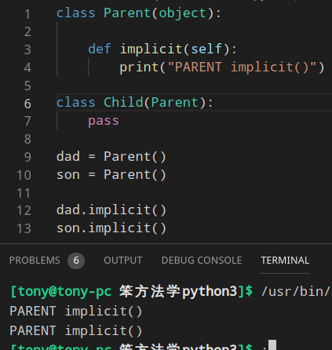
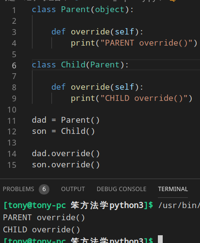
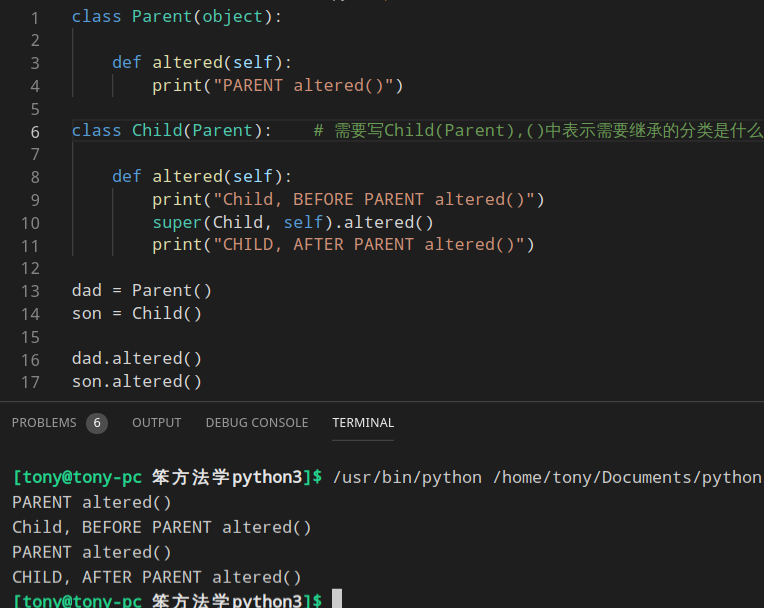
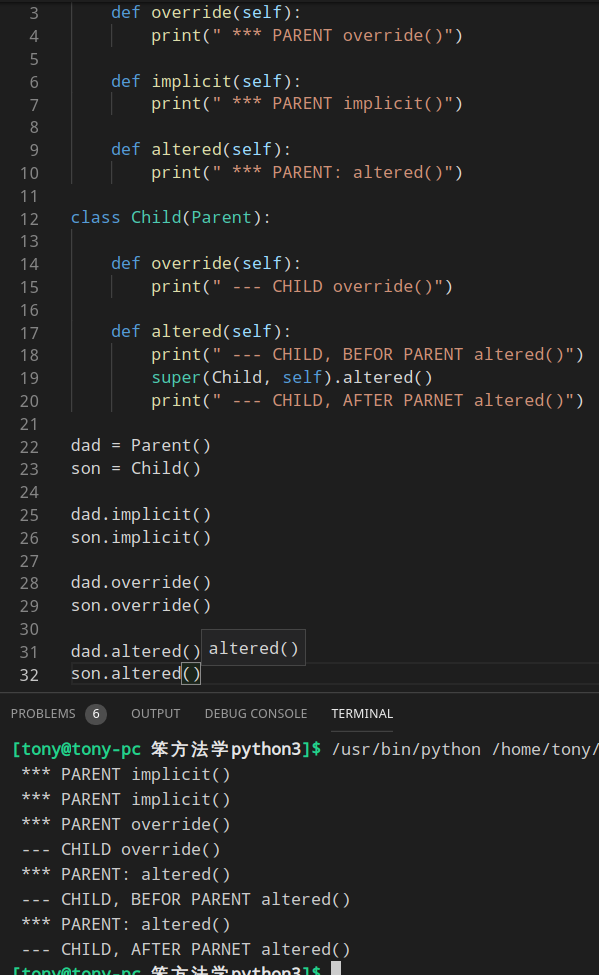

[TOC]
# 继承
### Implicit Inheritance
```python
class Parent(object):

    def implicit(self):
        print("PARENT implicit()")

class Child(Parement):
    pass

dad = Parent()
son = Parent()

dad.implicit()
son.implicit()
```


### Override_Explicitly
```python
class Parent(object):

    def override(self):
        print("PARENT override()")
    
class Child(Parent):

    def override(self):
        print("CHILD override()")

dad = Parent()
son = Child()

dad.override()
son.override()
```


### Alter Before or After
```python
class Parent(object):

    def altered(self):
        print("PARENT altered()")

class Child(Parent):    # 需要写Child(Parent),()中表示需要继承的分类是什么

    def altered(self):
        print("Child, BEFORE PARENT altered()")
        super(Child, self).altered()
        print("CHILD, AFTER PARENT altered()")

dad = Parent()
son = Child()

dad.altered()
son.altered()
```


### 三种方式混合


### super()与 __init__ 配合使用
```python
class Child(Parent):

    def __init__(self, stuff):
        self.stuff = stuff
        super(Child, self).__init__()
```

# 组合
继承是让子类实现父类的功能，但是还有另一种方式可以实现 —— <b>组合</b>
```python
class Child(object):    # 这里不是Chlid(Other) 不是继承 

    def __init__(self):
        self.other = Other()    #实现组合就是这种Child类里面定义一个Other()
```

# 总结
<b>继承</b>与<b>组合</b>说到底就是为了解决 <i>代码复用</i> 的问题<br>
继承:创建子类的时候可以隐含父类的功能<br>
组合:利用模块与其他类中的<b>函数调用</b>来达到目的的<br>
> 建议
> - 避免多继承,除非思路清晰
> - 如果一些代码会在不同位置应用,那就用<b>组合</b>做成模块

### 巩固练习
[连接](https://www.python.org/dev/peps/pep-0008/)