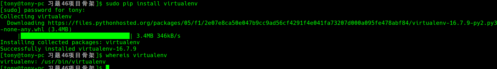
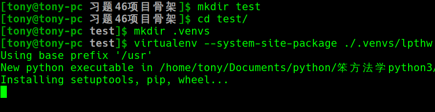
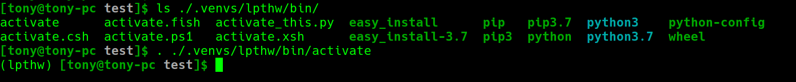
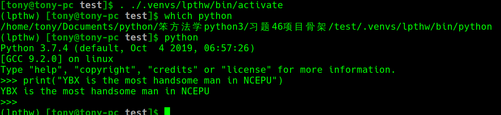
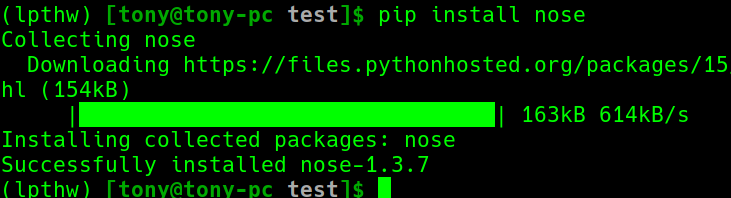
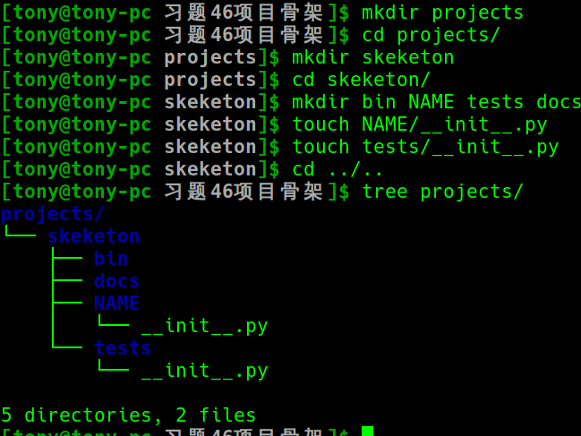
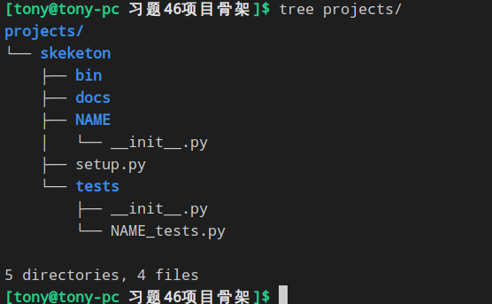
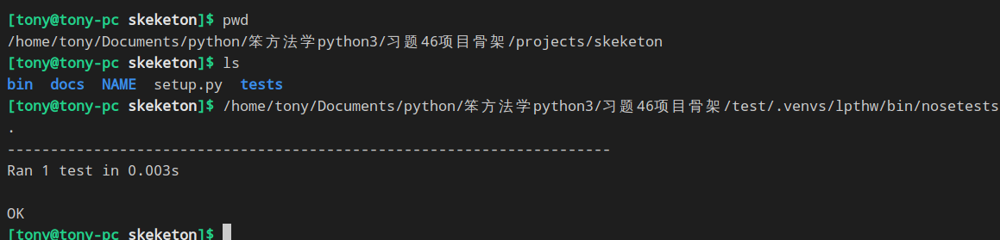

# 习题46 项目骨架
[TOC]
### 为什么创建项目骨架
这个项目骨架具备让这个项目运行起来的所有基本内容
> 文件布局
> 自动测试代码
> 模块
> 安装脚本

所以,以后每当建议一个新项目的时候,只要吧着了目录复制一份就可以了(当然需要改名字)
### 安装虚拟Python环境 —— virtualenv

##### Step1.创建一个 .venvs 的目录来存储所有的虚拟环境
```--systme-site-package```是让这个虚拟环境包含<b>系统站点包</b>,在.venvs/lpthw下创建虚拟环境

##### 进入虚拟环境
```$> . ./.venvs/lpthw/bin/activate ```

##### 测试


### 安装测试框架 —— nose


### 创建骨架目录


### 最终目录结构


### 确认目录
```$> nosetests```
